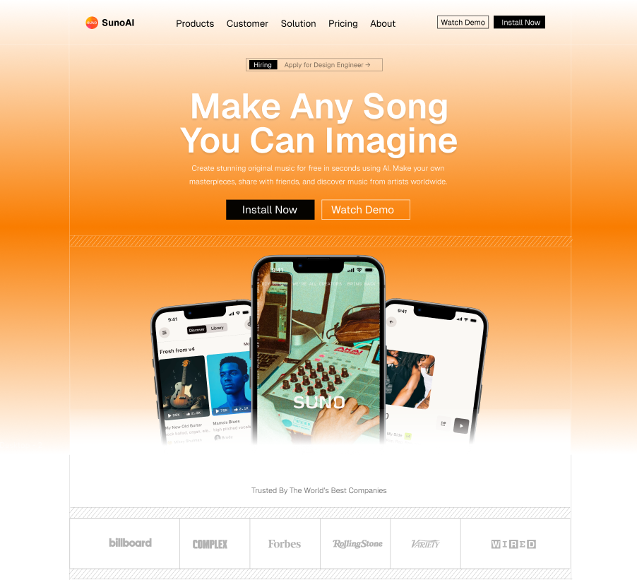

# Mobile SaaS Marketing Template

A sharp, conversion-focused marketing page template for mobile SaaS products, built for the Solace UI marketing library. It includes a full landing page structure with hero, press logos, feature cards, pricing, CTA, and footer sections.

The visual language is intentionally crisp: no rounded design system, strong borders, high-contrast type, orange brand energy, subtle motion, and mobile-first responsiveness.

## Preview



## Features

- Modern Next.js App Router setup
- Tailwind CSS v4 theme tokens
- shadcn preset with Base UI primitives
- Hugeicons-ready dependency setup
- Motion-powered section reveals
- Responsive marketing page sections
- No-rounded visual language
- Animated hero copy
- On-scroll logo, CTA, and feature interactions
- Looping waveform component for feature cards
- Pricing, CTA, and footer sections included

## Stack

- `Next.js 16`
- `React 19`
- `Tailwind CSS 4`
- `motion`
- `@base-ui/react`
- `shadcn`
- `@hugeicons/react`
- `@hugeicons/core-free-icons`

## Getting Started

Install dependencies:

```bash
npm install
```

Run the development server:

```bash
npm run dev
```

Open `http://localhost:3000` in your browser.

## Scripts

```bash
npm run dev
npm run build
npm run start
npm run lint
```

## Project Structure

```txt
src/
  app/
    globals.css
    layout.tsx
    page.tsx
  components/
    marketing/
      animated-group.tsx
      cta.tsx
      features.tsx
      footer.tsx
      hero.tsx
      logos.tsx
      looping-waveform.tsx
      navbar.tsx
      pricing.tsx
      triple-phone.tsx
    ui/
      button.tsx
  lib/
    utils.ts
```

## Customization

### Brand Color

The primary color is defined in `src/app/globals.css`:

```css
--primary: #f97c00;
```

Update this token to change the main accent color across the template.

### Radius

This template is designed with a no-rounded style:

```css
--radius: 0rem;
```

Keep this value if you want to preserve the Solace UI visual direction.

### Page Sections

The landing page is assembled in `src/app/page.tsx`:

```tsx
<Navbar />
<Hero />
<Logos />
<Features />
<Pricing />
<CTA />
<Footer />
```

Each section is isolated under `src/components/marketing`, so you can remove, reorder, or customize sections without touching the rest of the page.

## Notes

- The template uses `motion` for tasteful entrance animations.
- The phone mockup section is intentionally left independent from the hero text animation.
- The waveform component is decorative and does not request microphone permissions.
- The layout uses a centered max-width page container with left and right borders.

## License

Licensed under the [MIT License](./LICENSE).

Copyright (c) 2026 Solace UI.
